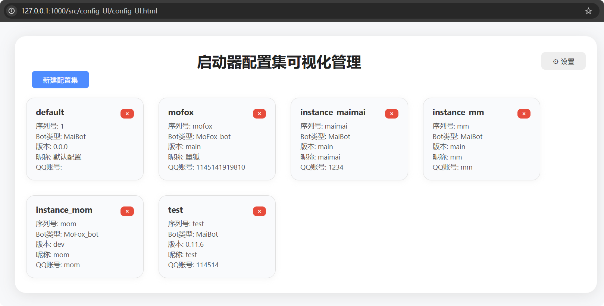

# 配置管理

进入方式：

主菜单`[B] 🔧 配置管理（新建/修改/检查配置）` → `[C] 🔧 配置管理（查看/编辑/删除配置）`

这个是用于管理配置集的，是十分重要的区域，配置集完好是 MCStart 启动器中的核心，也是启动器启动实例的必要条件。
## 查看配置详情
选项`[A] 👁️ 查看配置详情`

顾名思义，就是查看配置集的详情。输入你要查看的配置集的序列号以选择你要查看的配置集的详情，没什么好说的。
```
请输入您要使用的实例序列号（输入Q返回）： (): test
                                配置详情: test
┏━━━━━━━━━━━━━━┳━━━━━━━━━━━━━━━━━━━━━━━━━━━━━━━━━━━━━━━━━━━━━┳━━━━━━━━━━━━━━━┓
┃ 项目         ┃ 值                                          ┃ 状态          ┃
┡━━━━━━━━━━━━━━╇━━━━━━━━━━━━━━━━━━━━━━━━━━━━━━━━━━━━━━━━━━━━━╇━━━━━━━━━━━━━━━┩
│ 用户序列号   │ test                                        │ ✅ 已设置     │
│ 绝对序列号   │ 6                                           │ ✅ 已设置     │
│ 昵称         │ test                                        │ ✅ 已设置     │
│ 版本         │ 0.11.6                                      │ ✅ 已设置     │
│ QQ           │ 114514                                      │ ✅ 已设置     │
│ 麦麦本体路径 │ D:\MaiCore-Start\test\MaiBot                │ ✅ 存在       │
│ 适配器路径   │ D:\MaiCore-Start\test\MaiBot-Napcat-Adapter │ ✅ 存在       │
│ NapCat路径   │ D:\MaiCore-Start\test\NapCat                │ ✅ 存在       │
│ MongoDB状态  │ 已跳过安装                                  │ ❌ 已跳过安装 │
│ WebUI路径    │ D:\MaiCore-Start\test\MaiBot-Dashboard      │ ✅ 存在       │
└──────────────┴─────────────────────────────────────────────┴───────────────┘

[🔧 安装选项]
┏━━━━━━━━━┳━━━━━━━━━━━┓
┃ 组件    ┃ 安装状态  ┃
┡━━━━━━━━━╇━━━━━━━━━━━┩
│ 适配器  │ ✅ 已选择 │
│ NapCat  │ ✅ 已选择 │
│ MongoDB │ ⏭️ 已跳过  │
│ WebUI   │ ✅ 已选择 │
└─────────┴───────────┘
按回车键继续...
```
## 直接编辑配置
选项`[B] 📝 直接编辑配置`

直接在TUI中编辑配置文件（就相当于选择性的重新配置），体验可能不是很好，并且有些参数是不支持更改的（是为了保护配置集，不是技术问题），如要编辑编辑配置，推荐使用[可视化编辑配置](#可视化编辑配置)功能。

## 可视化编辑配置

选项`[C] 👁️ 可视化编辑配置`

这是一个WebUI，用于可视化编辑/创建/删除配置集，使用方法：

选择`C`选项并回车，程序会自动打开一个新的终端窗口并自动在浏览器中访问`http://127.0.0.1:1000/src/config_UI/config_UI.html`
| 主题 | 预览 |
| --- | --- |
| dark |  |
| light |  |

你可以在这里选择相应的配置集进行编辑，也可以新建/删除一个配置集。

同时你也可以点击右上角的设置键，在这里设置程序的代理系统，调节UI的主题和它与后端通信的端口。


<mark>设置完成后记得保存，有些设置需要需要重启程序才能生效。</mark>

## 验证配置
选项`[D] 🔍 验证配置`

说实在的，没啥用的一个功能，唯一的作用就是检查配置集的合法性，看看配置的路径下是否有目标文件。

## 新建配置集
选项`[E] ✨ 新建配置集`

新建一个配置集，两种模式，[<u>**`[A] 自动检索实例`**</u>](./automatic.md)、[<u>**`[B] 手动配置`**</u>](./manual.md)

## 删除配置集
选项`[F] 🗑️ 删除配置集`

删除配置集，为了防止误删，会要求盲输配置集序列号。删除配置集不会释放实例。

## 打开实例配置文件
选项`[G] 📝 打开实例配置文件`

在文本编辑器中打开目标实例的配置文件，如`.env`、`bot_config.toml`、`model_config.toml`等，方便修改实例配置。

