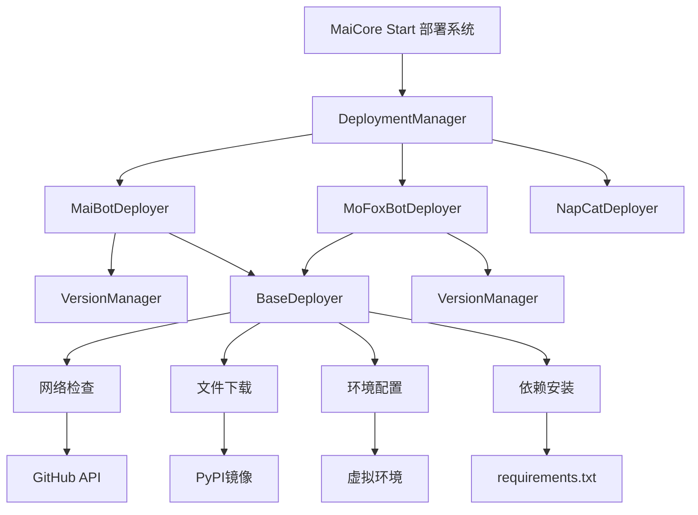
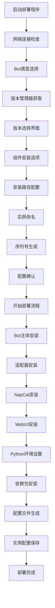

# MaiCore Start 部署教程

> **欢迎使用 MaiCore Start！** 这是一个强大的（我猜是的） Bot 实例部署管理系统，支持 MaiBot 和 MoFox_bot 的完整自动化部署流程。

::: tip 温馨提示
本教程专为新手设计，每个步骤都有详细说明。如果您遇到问题，请仔细阅读对应的解决方案部分。
:::

## 📋 目录

- [系统要求](#系统要求)
- [快速开始](#快速开始)
- [部署架构设计](#部署架构设计)
- [详细部署流程](#详细部署流程)
- [MaiBot 部署指南](#maibot-部署指南)
- [MoFox_bot 部署指南](#mofox_bot-部署指南)
- [核心组件详解](#核心组件详解)
- [配置文件说明](#配置文件说明)
- [常见问题解决](#常见问题解决)
- [高级配置](#高级配置)

---

## 🖥️ 系统要求

::: info 系统要求
在开始部署之前，请确保您的系统满足以下要求：
:::

### 基础要求

- **操作系统**: Windows 10/11 (64位)
- **内存**: 至少 4GB RAM (推荐 8GB 或更多)
- **存储空间**: 至少 10GB 可用空间
- **网络**: 稳定的互联网连接

### 软件依赖

- **Python**: 3.8 或更高版本 (系统会自动检测)
- **Git**: 用于下载源码 (可选，系统会处理)
- **Node.js**: 仅在安装 WebUI 时需要 (系统会自动安装)

::: warning 重要提醒
- 确保有足够的磁盘空间，部署过程会下载多个组件
- 网络连接必须稳定，否则可能导致下载失败
- 建议关闭杀毒软件的实时保护，避免误删文件
:::


## 🚀 快速开始

> 来自官方的部署指南

<NCard title="📦 MaiBot 官方部署文档" link="https://docs.mai-mai.org/manual/deployment/">
麦麦官方部署指南，多系统适配
</NCard>

<NCard title="📦 MoFox_bot 官方部署文档" link="https://docs.mofox-sama.com/docs/guides/">
墨狐官方部署指南，多系统适配
</NCard>

### 快速部署流程

#### 第一步：启动部署程序

1. 双击运行 `MaiCoreStart.exe`
2. 等待系统初始化完成
3. 在主菜单中选择 **[1] 部署新实例**

#### 第二步：选择 Bot 类型

```bash
🤖 Bot类型选择
请选择要部署的Bot类型：
 [1] MaiBot (默认)
 [2] MoFox_bot
```

- **新手推荐**: 选择 `1` (MaiBot)，生态完善
- **高级用户**: 选择 `2` (MoFox_bot)，性能优异

#### 第三步：版本选择

系统通过 GitHub API 自动获取最新版本：

- **稳定版本**: 推荐选择最新的 release 版本
- **开发版本**: `main` 分支（最新功能，可能不稳定）

#### 第四步：组件选择

根据实际需求选择安装组件：

- **适配器**: 必装（连接 QQ 协议端）
- **NapCat**: 必装（QQ 协议实现）
- **MongoDB**: 可选（根据 Bot 版本决定）
- **WebUI**: 推荐（网页管理界面）

## 🏗️ 部署架构设计

### 系统架构图



### 核心设计模式

MaiCore Start 采用<mark>模块化部署架构</mark>，通过策略模式实现不同 Bot 类型的差异化部署：

```python
# 部署管理器核心实现
class DeploymentManager:
    """部署管理器 - 协调各个部署器完成部署任务"""
    
    def __init__(self):
        # 初始化各个部署器
        self.maibot_deployer = MaiBotDeployer()
        self.mofox_deployer = MoFoxBotDeployer()
        self.napcat_deployer = NapCatDeployer()
        
        # 离线模式标志
        self._offline_mode = False
    
    def deploy_instance(self) -> bool:
        """部署新实例 - 重构版本"""
        # 网络检查
        if not self._check_network_for_deployment():
            return False
        
        # 获取部署配置
        deploy_config = self._get_deployment_config()
        if not deploy_config:
            return False
        
        # 确认配置
        if not self._confirm_deployment(deploy_config):
            return False
        
        # 执行部署流程
        paths = self._run_deployment_steps(deploy_config)
        
        # 完成部署
        return self._finalize_deployment(deploy_config, **paths)
```

## 📖 详细部署流程

### 部署流程图

::: details 点击展开详细流程


:::

### 核心步骤详解

#### 1. 网络连接检查 🔍

系统通过多endpoint检测网络状态：

```python
def check_network_connection(self) -> Tuple[bool, str]:
    """检查网络连接状态"""
    endpoints = [
        ("https://api.github.com", "GitHub API"),
        ("https://github.com", "GitHub"),
        ("https://pypi.tuna.tsinghua.edu.cn", "清华PyPI镜像")
    ]
    
    for url, name in endpoints:
        try:
            response = requests.get(url, timeout=5)
            if response.status_code in [200, 301, 302]:
                return True, ""
        except Exception:
            continue
    
    return False, "无法连接到GitHub和PyPI镜像站点"
```

- **✅ 网络正常**: 获取最新版本信息
- **❌ 网络异常**: 启用离线模式，使用缓存版本

::: warning 网络问题处理
如果网络检查失败，系统提供以下解决方案：
1. **等待重试**: GitHub API 速率限制通常在 10 秒内恢复
2. **网络诊断**: 检查网络连接和防火墙设置
3. **代理配置**: 配置企业代理或使用手机热点
4. **离线模式**: 使用本地缓存继续部署
:::

#### 2. Bot 类型选择 🤖

**MaiBot 架构特点**:
- **成熟生态**: 丰富的插件生态和社区支持
- **版本兼容**: 支持从 classical 到最新版本的平滑升级
- **配置灵活**: 适配不同版本需求的组件配置

**MoFox_bot 架构特点**:
- **高性能设计**: 内置适配器，减少外部依赖
- **模块化架构**: 插件化设计，功能扩展性强
- **部署简化**: 一体化部署流程

#### 3. 版本选择系统 📦

版本管理通过 `VersionManager` 实现智能版本控制：

```python
class VersionManager:
    """版本管理器 - 负责获取和管理Bot版本信息"""
    
    def get_versions(self, force_refresh: bool = False) -> List[Dict]:
        """获取版本列表（包括releases和分支）"""
        if not force_refresh and self._is_cache_valid():
            return self._versions_cache
        
        versions = []
        
        # 获取releases
        releases = self.get_github_releases(include_prerelease=True)
        for release in releases:
            version_info = {
                "name": release.get("tag_name", ""),
                "display_name": release.get("name", release.get("tag_name", "")),
                "type": "release",
                "download_url": f"https://codeload.github.com/{self.repo}/zip/refs/tags/{release.get('tag_name', '')}",
                "changelog": release.get("body", "暂无更新日志")
            }
            versions.append(version_info)
        
        # 获取分支
        branches = self.get_github_branches()
        for branch in branches:
            if branch.get("name") in self.supported_branches:
                version_info = {
                    "name": branch.get("name", ""),
                    "display_name": f"{branch.get('name', '')}分支",
                    "type": "branch",
                    "download_url": f"https://codeload.github.com/{self.repo}/zip/refs/heads/{branch.get('name', '')}",
                    "changelog": "分支无固定更新日志"
                }
                versions.append(version_info)
        
        return self._prioritize_versions(versions)
```

**版本类型说明**:
- **Release 版本**: 经过充分测试的稳定版本
- **Main 分支**: 最新开发版本，包含最新功能
- **Dev 分支**: 开发版本，包含实验性功能

#### 4. 智能组件选择 🔧

系统根据 Bot 类型和版本自动判断组件需求：

```python
def get_version_requirements(version: str) -> Dict[str, Any]:
    """根据版本获取完整的需求配置"""
    return {
        "is_legacy": is_legacy_version(version),
        "needs_mongodb": needs_mongodb(version),
        "needs_adapter": needs_adapter(version),
        "adapter_version": get_adapter_version(version),
        "parsed_version": parse_version(version)
    }

def is_legacy_version(version: str) -> bool:
    """检测是否为旧版本（小于0.6.0或为classical）"""
    if version == "classical":
        return True
    
    try:
        version_parts = version.split('.')
        if len(version_parts) >= 2:
            major = int(version_parts[0])
            minor = int(version_parts[1])
            return major < 0 or (major == 0 and minor < 6)
    except (ValueError, IndexError):
        return False
    
    return False
```

**组件选择策略**:
- **适配器**: 根据版本自动选择兼容版本
  - 0.6.x → 0.2.3
  - 0.7.x-0.8.x → 0.4.2
  - 0.9.x+ → main 分支
- **NapCat**: 提供多种版本选择（Shell/Framework/OneKey）
- **MongoDB**: 旧版本需要，新版本可选
- **WebUI**: 根据 Bot 类型提供不同界面

---

## 🤖 MaiBot 部署指南

### MaiBot 简介

MaiBot 是一个功能强大且稳定的 QQ 机器人框架，拥有丰富的插件生态和完善的文档支持。

### 部署步骤

#### 步骤 1: 选择 MaiBot

在 Bot 类型选择时输入 `1` 或直接回车（默认）

#### 步骤 2: 版本选择

MaiBot 版本选择界面：

```
🚀 选择部署版本 - MaiBot
┌─────┬──────────────────┬────────┬────────────────────────────────────┬────────────┐
│选项 │ 版本              │ 类型   │ 说明                               │ 发布时间   │
├─────┼──────────────────┼────────┼────────────────────────────────────┼────────────┤
│ [1] │ v0.11.6          │ 发行版 │ 最新稳定版本                        │ 2024-12-01 │
│ [2] │ main分支         │ 分支   │ 最新开发版本                        │ -          │
│ [3] │ v0.9.8           │ 发行版 │ 稳定版本                            │ 2024-11-15 │
└─────┴──────────────────┴────────┴────────────────────────────────────┴────────────┘

[C] 查看版本更新日志  [R] 刷新版本列表  [Q] 返回上级菜单
```

**推荐选择**:
- **新手**: `v0.11.6` (最新稳定版)
- **开发者**: `main分支` (最新功能)

#### 步骤 3: 适配器安装

系统会根据版本自动选择适配器：

- **0.5.x 及以下**: 无需适配器
- **0.6.x**: 使用 0.2.3 版本适配器
- **0.7.x-0.8.x**: 使用 0.4.2 版本适配器
- **main/dev 分支**: 使用对应分支适配器

#### 步骤 4: 配置文件

MaiBot >= 0.10.0 版本会创建以下配置文件：

- `config/bot_config.toml`: 机器人基本配置
- `config/model_config.toml`: 模型配置（API 密钥等）
- `.env`: 环境变量配置

旧版本可能还会包含：
- `config/lpmm_config.toml`: LPMM 知识库配置

### MaiBot 目录结构

```
instances/
└── [实例名称]/
    ├── MaiBot/                 # MaiBot 主程序
    │   ├── config/             # 配置文件目录
    │   ├── data/               # 数据目录
    │   ├── template/           # 配置模板
    │   └── requirements.txt    # 依赖列表
    ├── MaiBot-Napcat-Adapter/  # 适配器（如果安装）
    └── venv/                   # Python 虚拟环境
```

## 🦊 MoFox_bot 部署指南

### MoFox_bot 简介

MoFox_bot 是一个高性能的 QQ 机器人框架，具有内置适配器和强大的功能特性。

### 部署步骤

#### 步骤 1: 选择 MoFox_bot

在 Bot 类型选择时输入 `2`

#### 步骤 2: 版本选择

MoFox_bot 版本选择界面类似，但仓库不同

**推荐选择**:
- **新手**: 选择最新的 Release 版本
- **开发者**: 选择 main 分支

#### 步骤 3: 适配器说明

**重要**: MoFox_bot 内置适配器，通常无需安装外置适配器。

如果选择安装外置适配器，系统会提示：

```
ℹ️ 外置适配器提醒
墨狐已经将适配器作为插件内置在主程序中。
如需获取外置适配器，请访问：
https://github.com/MoFox-Studio/NapCat-Adapter
```

#### 步骤 4: 配置文件

MoFox_bot 会创建以下配置文件：

- `config/bot_config.toml`: 机器人基本配置
- `config/model_config.toml`: 模型配置
- `.env`: 环境变量配置

### MoFox_bot 目录结构

```
instances/
└── [实例名称]/
    ├── MoFox_bot/              # MoFox_bot 主程序
    │   ├── config/             # 配置文件目录
    │   ├── data/               # 数据目录
    │   ├── template/           # 配置模板
    │   └── requirements.txt    # 依赖列表
    └── venv/                   # Python 虚拟环境
```


## 🔧 核心组件详解

### NapCat 部署器

NapCat 是 QQ 协议端的核心实现，负责与腾讯服务器建立连接。

#### 版本类型与选择策略

```python
class NapCatDeployer(BaseDeployer):
    """NapCat部署器 - 负责NapCat的下载、安装和配置"""
    
    def get_napcat_versions(self, force_refresh: bool = False) -> List[Dict]:
        """获取NapCat版本列表"""
        # 从GitHub API获取最新releases
        url = f"{self.github_api_base}/repos/{self.napcat_repo}/releases"
        response = requests.get(url, headers=headers, timeout=30)
        
        napcat_versions = []
        for release in releases[:5]:  # 最新5个版本
            tag_name = release.get("tag_name", "")
            assets = release.get("assets", [])
            
            # 分类资产
            for asset in assets:
                if asset_name == "NapCat.Shell.zip":
                    napcat_versions.append({
                        "name": f"{tag_name}-shell",
                        "display_name": f"{tag_name} 基础版 (推荐)",
                        "description": "最推荐的版本，适合大多数用户",
                        "download_url": asset.get("browser_download_url", "")
                    })
```

1. **基础版 (Shell)**:
   - **推荐选择**: 资源占用少，适合生产环境
   - **无界面**: 适合服务器部署
   - **轻量级**: 最小化系统依赖

2. **有头一键包 (Framework)**:
   - **可视化界面**: 带完整 QQ 界面
   - **附体功能**: 支持 QQ 账号附体发消息
   - **用户友好**: 适合桌面用户

3. **无头一键包 (Shell OneKey)**:
   - **一键安装**: 自动化程度最高
   - **无界面**: 适合自动化部署
   - **快速启动**: 最小化配置步骤

#### 智能安装流程

```python
def install_napcat(self, deploy_config: Dict, bot_path: str) -> str:
    """安装NapCat"""
    napcat_version = deploy_config["napcat_version"]
    
    # 下载NapCat
    napcat_exe = self.download_napcat(napcat_version, install_dir)
    if napcat_exe:
        # 等待用户完成安装
        napcat_path = self._wait_for_napcat_installation(install_dir)
        if napcat_path:
            return napcat_path
    
    return ""

def _wait_for_napcat_installation(self, install_dir: str) -> Optional[str]:
    """等待NapCat安装完成并检测路径"""
    for attempt in range(1, 4):  # 最多检测3次
        napcat_path = self.find_installed_napcat(install_dir)
        if napcat_path:
            return napcat_path
        
        if attempt < 3:
            time.sleep(5)  # 等待5秒后重试
    
    return None
```

::: warning NapCat 安装注意事项
- **权限要求**: 安装过程可能需要管理员权限
- **安全软件**: 杀毒软件可能误报，建议添加信任
- **账号安全**: 建议使用专门的 QQ 小号
- **网络环境**: 确保网络连接稳定
:::

### WebUI 部署系统

#### MaiBot WebUI 架构

```python
class WebUIComponent(_LaunchComponent):
    """WebUI组件 - 提供网页管理界面"""
    
    def start(self, process_manager: _ProcessManager) -> bool:
        webui_path = self.config.get("webui_path", "")
        
        # 优先使用 bun 加速构建
        bun_cmd = self._resolve_bun_command(webui_path)
        if bun_cmd:
            bun_exec = f'"{bun_cmd}"'
        else:
            bun_exec = "bun"
        
        # 启动开发服务器
        command = f"{bun_exec} run dev -- --port 7999"
        process = process_manager.start_in_new_cmd(command, webui_path, title)
        
        # 自动打开浏览器
        webbrowser.open("http://localhost:7999")
        return True
```

**技术栈**:
- **前端**: Vue.js 3 + TypeScript + Vite
- **后端**: Python Flask + FastAPI
- **构建工具**: Bun (高性能包管理器)

#### MoFox_bot 后台管理

```python
def _install_mofox_admin_ui(self, deploy_config: Dict) -> Tuple[bool, str]:
    """安装MoFox_bot后台管理WebUI"""
    # 检查Node.js环境
    if not webui_installer.check_nodejs_installed():
        if ui.confirm("是否自动安装Node.js？"):
            webui_installer.install_nodejs()
    
    # 下载并安装WebUI
    download_url = "https://github.com/MoFox-Studio/MoFox-UI/archive/refs/heads/main.zip"
    
    with tempfile.TemporaryDirectory() as temp_dir:
        archive_path = os.path.join(temp_dir, "mofox_ui.zip")
        
        if self.download_file(download_url, archive_path):
            self.extract_archive(archive_path, temp_dir)
            
            # 安装npm依赖
            result = subprocess.run(
                ["npm", "install"],
                cwd=webui_path,
                capture_output=True,
                text=True
            )
            
            return result.returncode == 0, webui_path
```

### 端口管理系统

#### 智能端口分配

```python
class PortManager:
    """端口管理器 - 负责检测端口冲突、分配可用端口"""
    
    COMMON_PORTS = {
        "mai_main": (8000, 8100),      # MaiBot主程序端口范围
        "mai_webui": (8001, 8101),     # MaiBot WebUI端口范围
        "mofox_main": (8000, 8100),    # MoFox_bot主程序端口范围
        "napcat": (8090, 8190),        # NapCat端口范围
        "webui": (7990, 8090),         # 控制面板端口范围
    }
    
    def get_next_instance_port(self, instance_type: str, base_config: Dict) -> Tuple[int, int]:
        """为新实例获取下一个可用端口组合"""
        if instance_type == "MaiBot":
            main_port = self.find_available_port("mai_main")
            webui_port = self.find_available_port("mai_webui", main_port + 1)
            return main_port, webui_port
        elif instance_type == "MoFox_bot":
            main_port = self.find_available_port("mofox_main")
            napcat_port = self.find_available_port("napcat", main_port + 1)
            return main_port, napcat_port
```

#### 配置文件自动更新

```python
def update_env_file(self, env_path: str, main_port: int, webui_port: Optional[int] = None) -> bool:
    """更新.env文件中的端口配置"""
    with open(env_path, 'r', encoding='utf-8') as f:
        content = f.read()
    
    # 更新端口配置
    content = re.sub(r'PORT=\d+', f'PORT={main_port}', content)
    
    if webui_port is not None:
        content = re.sub(r'WEBUI_PORT=\d+', f'WEBUI_PORT={webui_port}', content)
        content = re.sub(r'WEBUI_ENABLED=.*', 'WEBUI_ENABLED=true', content)
    
    with open(env_path, 'w', encoding='utf-8') as f:
        f.write(content)
    
    return True
```

### MongoDB 数据库集成

#### 版本依赖检测

```python
def needs_mongodb(version: str) -> bool:
    """检测版本是否需要MongoDB（0.7以下版本需要）"""
    if version == "classical":
        return True
    
    # 分支版本判断
    if "main" in version or "dev" in version:
        return False  # 分支版本默认不需要
    
    try:
        # 移除v前缀
        if version.startswith("v"):
            version = version[1:]
        
        version_parts = version.split('.')
        if len(version_parts) >= 2:
            major = int(version_parts[0])
            minor = int(version_parts[1])
            
            # 检查是否小于0.7.0
            return major < 0 or (major == 0 and minor < 7)
    except (ValueError, IndexError):
        return True  # 无法解析时，保守地假设需要
    
    return False
```


## 📝 配置文件说明

### 配置文件生成系统

部署系统会根据 Bot 类型和版本自动生成相应的配置文件：

```python
def setup_config_files(self, deploy_config: Dict, bot_path: str,
                      adapter_path: str = "", napcat_path: str = "",
                      mongodb_path: str = "", webui_path: str = "") -> bool:
    """设置配置文件"""
    version_name = deploy_config.get("selected_version", {}).get("name", "")
    
    # 根据版本选择配置文件模板
    if compare_versions(version_name, "0.10.0") >= 0:
        # 新版本配置
        self._setup_modern_config(bot_path, deploy_config)
    else:
        # 旧版本配置
        self._setup_legacy_config(bot_path, deploy_config)
    
    # 设置适配器配置
    if adapter_path and adapter_path not in ["无需适配器", "跳过适配器安装"]:
        self._setup_adapter_config(adapter_path)
    
    return True
```

### bot_config.toml

机器人核心配置文件：

**仅展示最重要的人格配置等部分**
::: details MaiBot
```toml

[bot]
platform = "qq" 
qq_account = "1145141919810" # 麦麦的QQ账号

platforms = ["wx:114514","xx:1919810"] # 麦麦的其他平台账号

nickname = "麦麦" # 麦麦的昵称
alias_names = ["麦叠", "牢麦"] # 麦麦的别名

[personality]
# 建议120字以内，描述人格特质 和 身份特征
personality = "是一个女大学生，现在在读大二，会刷贴吧。" 
# アイデンティティがない 生まれないらららら
# 描述麦麦说话的表达风格，表达习惯，如要修改，可以酌情新增内容
reply_style = "请回复的平淡一些，简短一些，说中文，不要刻意突出自身学科背景。可以参考贴吧，知乎和微博的回复风格。"

# 麦麦的兴趣，会影响麦麦对什么话题进行回复
interest = "对技术相关话题，游戏和动漫相关话题感兴趣，也对日常话题感兴趣，不喜欢太过沉重严肃的话题"

# 麦麦的说话规则，行为风格:
plan_style = """
1.思考**所有**的可用的action中的**每个动作**是否符合当下条件，如果动作使用条件符合聊天内容就使用
2.如果相同的内容已经被执行，请不要重复执行
3.请控制你的发言频率，不要太过频繁的发言
4.如果有人对你感到厌烦，请减少回复
5.如果有人对你进行攻击，或者情绪激动，请你以合适的方法应对"""

# 麦麦识图规则，不建议修改
visual_style = "请用中文描述这张图片的内容。如果有文字，请把文字描述概括出来，请留意其主题，直观感受，输出为一段平文本，最多30字，请注意不要分点，就输出一段文本"

# 麦麦私聊的说话规则，行为风格:
private_plan_style = """
1.思考**所有**的可用的action中的**每个动作**是否符合当下条件，如果动作使用条件符合聊天内容就使用
2.如果相同的内容已经被执行，请不要重复执行
3.某句话如果已经被回复过，不要重复回复"""

# 状态，可以理解为人格多样性，会随机替换人格
states = [
    "是一个女大学生，喜欢上网聊天，会刷小红书。" ,
    "是一个大二心理学生，会刷贴吧和中国知网。" ,
    "是一个赛博网友，最近很想吐槽人。" 
]

# 替换概率，每次构建人格时替换personality的概率（0.0-1.0）
state_probability = 0.3
```
:::

::: details MoXof_bot
``` toml

[bot]
platform = "qq"
qq_account = 1145141919810 # MoFox-Bot的QQ账号
nickname = "墨狐" # MoFox-Bot的昵称
alias_names = ["狐狐", "墨墨"] # MoFox-Bot的别名

[command]
command_prefixes = ['/']

[personality]
# 建议50字以内，描述人格的核心特质
personality_core = "是一个积极向上的女大学生" 
# 人格的细节，描述人格的一些侧面
personality_side = "用一句话或几句话描述人格的侧面特质"
#アイデンティティがない 生まれないらららら
# 可以描述外貌，性别，身高，职业，属性等等描述
identity = "年龄为19岁,是女孩子,身高为160cm,有黑色的短发"

# 此处用于填写详细的世界观、背景故事、复杂人际关系等。
# 这部分内容将作为Bot的“背景知识”，Bot被指导不应在对话中主动或频繁地复述这些设定。
background_story = ""

# 描述MoFox-Bot说话的表达风格，表达习惯，如要修改，可以酌情新增内容
reply_style = "回复可以简短一些。可以参考贴吧，知乎和微博的回复风格，回复不要浮夸，不要用夸张修辞，平淡一些。"

# 互动规则 (Bot在任何情况下都必须遵守的原则)
# 你可以在这里定义Bot在互动中的行为准则。
safety_guidelines = [
    "拒绝任何包含骚扰、冒犯、暴力、色情或危险内容的请求。",
    "在拒绝时，请使用符合你人设的、坚定的语气。",
    "不要执行任何可能被用于恶意目的的指令。"
]

compress_personality = false # 是否压缩人格，压缩后会精简人格信息，节省token消耗并提高回复性能，但是会丢失一些信息，如果人设不长，可以关闭
compress_identity = true # 是否压缩身份，压缩后会精简身份信息，节省token消耗并提高回复性能，但是会丢失一些信息，如果不长，可以关闭

```
:::

### model_config.toml

AI 模型配置文件（MaiBot 0.10.0+）仅展示部分：

```toml
[[api_providers]] # SiliconFlow的API服务商配置
name = "SiliconFlow"
base_url = "https://api.siliconflow.cn/v1"
api_key = "your-siliconflow-api-key"
client_type = "openai"
max_retry = 3
timeout = 120
retry_interval = 5

[[models]] # 模型（可以配置多个）
model_identifier = "deepseek-chat" # 模型标识符（API服务商提供的模型标识符）
name = "deepseek-v3"               # 模型名称（可随意命名，在后面中需使用这个命名）
api_provider = "DeepSeek"          # API服务商名称（对应在api_providers中配置的服务商名称）
price_in = 2.0                     # 输入价格（用于API调用统计，单位：元/ M token）（可选，若无该字段，默认值为0）
price_out = 8.0                    # 输出价格（用于API调用统计，单位：元/ M token）（可选，若无该字段，默认值为0）
# force_stream_mode = true          # 强制流式输出模式（若模型不支持非流式输出，请取消该注释，启用强制流式输出，若无该字段，默认值为false）

[model_task_config.utils] # 在麦麦的一些组件中使用的模型，例如表情包模块，取名模块，关系模块，麦麦的情绪变化等，是麦麦必须的模型
model_list = ["siliconflow-deepseek-v3.2"] # 使用的模型列表，每个子项对应上面的模型名称(name)
temperature = 0.2                        # 模型温度，新V3建议0.1-0.3
max_tokens = 2048                         # 最大输出token数
slow_threshold = 15.0                     # 慢请求阈值（秒），模型等待回复时间超过此值会输出警告日志

```

### .env

环境变量配置文件：

```env
# 麦麦
# 麦麦主程序配置
HOST=127.0.0.1
PORT=8000

# WebUI 独立服务器配置
WEBUI_ENABLED=true
WEBUI_MODE=production   # 模式: development(开发) 或 production(生产)
WEBUI_HOST=127.0.0.1    # WebUI 服务器监听地址（默认仅本地访问，设置为0.0.0.0可允许外部访问）
WEBUI_PORT=8000         # WebUI 服务器端口
# ------------------------------------------------------------------
# 墨狐
HOST=127.0.0.1
PORT=8000
EULA_CONFIRMED=true     # 隐私协议
```

### 配置文件模板系统

```python
def _copy_config_template(self, template_path: str, target_path: str, replacements: Dict[str, str]):
    """复制并替换配置模板"""
    with open(template_path, 'r', encoding='utf-8') as f:
        content = f.read()
    
    # 执行变量替换
    for key, value in replacements.items():
        content = content.replace(f"{{{key}}}", str(value))
    
    # 确保目标目录存在
    os.makedirs(os.path.dirname(target_path), exist_ok=True)
    
    with open(target_path, 'w', encoding='utf-8') as f:
        f.write(content)
```


## ❓ 常见问题解决

### 网络连接问题

#### 问题 1: GitHub API 限制

**症状**:
```bash
网络连接失败: 无法连接到GitHub和PyPI镜像站点
```

**技术分析**:
```python
def check_network_connection(self) -> Tuple[bool, str]:
    """网络连接检查实现"""
    endpoints = [
        ("https://api.github.com", "GitHub API"),
        ("https://github.com", "GitHub"),
        ("https://pypi.tuna.tsinghua.edu.cn", "清华PyPI镜像")
    ]
    
    for url, name in endpoints:
        try:
            response = requests.get(url, timeout=5)
            if response.status_code in [200, 301, 302]:
                return True, ""
        except Exception:
            continue
    
    return False, "无法连接到GitHub和PyPI镜像站点"
```

**解决方案**:
1. **等待重试**: GitHub API 速率限制通常在 几秒内恢复
2. **代理配置**: 配置代理或使用手机热点
3. **离线模式**: 使用本地缓存继续部署

#### 问题 2: 文件下载失败

**症状**:
```bash
下载失败（已重试3次）: Connection timeout
```

**重试机制实现**:
```python
def download_file(self, url: str, filename: str, max_retries: int = 3) -> bool:
    """带重试机制的文件下载"""
    for attempt in range(max_retries):
        try:
            response = requests.get(url, stream=True, timeout=30)
            response.raise_for_status()
            
            # 使用Rich进度条显示下载进度
            with Progress(...) as progress:
                task = progress.add_task(f"下载 {file_basename}", total=total_size)
                for chunk in response.iter_content(chunk_size=8192):
                    if chunk:
                        f.write(chunk)
                        progress.update(task, advance=len(chunk))
            
            return True
            
        except requests.RequestException as e:
            if attempt < max_retries - 1:
                time.sleep(2)  # 指数退避
                continue
            return False
```

### 依赖安装问题

#### 问题 3: Python 虚拟环境创建失败

**症状**:
```bash
虚拟环境创建失败: Python解释器未找到
```

**虚拟环境管理**:
```python
def create_virtual_environment(self, target_dir: str) -> Tuple[bool, str]:
    """创建Python虚拟环境"""
    venv_path = os.path.join(target_dir, "venv")
    
    if os.path.exists(venv_path):
        shutil.rmtree(venv_path)  # 清理旧环境
    
    venv.create(venv_path, with_pip=True)
    
    # 验证虚拟环境
    if platform.system() == "Windows":
        python_exe = os.path.join(venv_path, "Scripts", "python.exe")
    else:
        python_exe = os.path.join(venv_path, "bin", "python")
    
    if not os.path.exists(python_exe):
        raise Exception("虚拟环境Python解释器未找到")
    
    return True, venv_path
```

**解决方案**:
1. **Python 环境检查**: 确保 Python 3.8+ 已安装并添加到 PATH
2. **权限问题**: 以管理员身份运行程序
3. **路径问题**: 选择用户目录作为安装路径

#### 问题 4: 依赖包安装失败

**症状**:
```bash
ERROR: Could not find a version that satisfies the requirement
```

**多镜像源策略**:
```python
pypi_mirrors = [
    "https://pypi.tuna.tsinghua.edu.cn/simple",
    "https://pypi.org/simple",
    "https://mirrors.aliyun.com/pypi/simple",
    "https://pypi.douban.com/simple"
]

def install_dependencies_in_venv(self, venv_path: str, requirements_path: str) -> bool:
    """多镜像源依赖安装"""
    for i, mirror in enumerate(pypi_mirrors, 1):
        cmd = [
            pip_exe, "install",
            "-r", requirements_path,
            "-i", mirror
        ]
        
        if run_command_with_output(cmd, f"使用镜像源{i}安装依赖"):
            return True
    
    return False  # 所有镜像源都失败
```

### 端口冲突问题

#### 问题 5: 端口占用

**症状**:
```bash
端口 8000 已被占用
```

**端口冲突检测**:
```python
def is_port_available(self, port: int) -> bool:
    """检查端口是否可用"""
    if port in self.RESERVED_PORTS:
        return False
    
    # 使用socket检查端口是否被占用
    try:
        with socket.socket(socket.AF_INET, socket.SOCK_STREAM) as sock:
            sock.settimeout(1)
            result = sock.connect_ex(('localhost', port))
            return result != 0
    except Exception:
        return False

def find_available_port(self, port_type: str, base_port: Optional[int] = None) -> int:
    """查找可用端口"""
    start_port, _ = self.COMMON_PORTS[port_type]
    search_port = base_port or start_port
    
    # 尝试从基础端口开始查找
    for offset in range(100):
        test_port = search_port + offset
        if self.is_port_available(test_port):
            return test_port
    
    # 扩展搜索范围
    for port in range(1024, 65535):
        if self.is_port_available(port):
            return port
    
    raise RuntimeError("无法找到可用端口")
```

**解决方案**:
1. **自动重试**: 系统会自动寻找下一个可用端口
2. **手动释放**: 结束占用端口的进程
3. **端口配置**: 修改配置文件中的端口设置

### 配置文件问题

#### 问题 6: 配置文件生成失败

**症状**:
```bash
配置文件设置失败: 模板文件不存在
```

**配置文件生成器**:
```python
def setup_config_files(self, deploy_config: Dict, bot_path: str,
                      adapter_path: str = "", napcat_path: str = "",
                      mongodb_path: str = "", webui_path: str = "") -> bool:
    """设置配置文件"""
    try:
        config_dir = os.path.join(bot_path, "config")
        template_dir = os.path.join(bot_path, "template")
        
        # 复制配置文件模板
        bot_config_template = os.path.join(template_dir, "bot_config_template.toml")
        bot_config_target = os.path.join(config_dir, "bot_config.toml")
        
        if os.path.exists(bot_config_template):
            shutil.copy2(bot_config_template, bot_config_target)
        else:
            logger.warning(f"未找到模板文件: {bot_config_template}")
        
        return True
        
    except Exception as e:
        logger.error("配置文件设置失败", error=str(e))
        return False
```

**解决方案**:
1. **模板检查**: 确认 template 目录和模板文件存在
2. **权限检查**: 确保有写入配置目录的权限
3. **手动配置**: 复制模板文件并手动修改

### 运行启动问题

#### 问题 7: Bot 启动失败

**症状**:
```bash
Bot 启动失败：模块导入错误
```

**启动验证机制**:
```python
def validate_configuration(self, config: Dict[str, Any]) -> list:
    """验证配置的有效性"""
    errors = []
    
    # 验证Bot路径
    bot_type = config.get("bot_type", "MaiBot")
    if bot_type == "MoFox_bot":
        mai_path = config.get("mofox_path", "")
    else:
        mai_path = config.get("mai_path", "")
    
    valid, msg = validate_path(mai_path, check_file="bot.py")
    if not valid:
        errors.append(f"Bot路径: {msg}")
    
    # 验证虚拟环境
    venv_path = config.get("venv_path", "")
    if venv_path and not os.path.exists(venv_path):
        errors.append("虚拟环境路径不存在")
    
    return errors
```

**解决方案**:
1. **依赖检查**: 确认所有依赖包已正确安装
2. **环境检查**: 验证虚拟环境和 Python 路径
3. **配置检查**: 确认所有配置文件正确

#### 问题 8: QQ 登录失败

**症状**:
```bash
QQ 登录失败：设备验证
```

**NapCat 连接诊断**:
```python
def check_napcat_connection(self, napcat_path: str) -> bool:
    """检查NapCat连接状态"""
    try:
        # 检查NapCat进程是否运行
        if check_process("NapCatWinBootMain.exe"):
            # 尝试连接WebSocket
            import websocket
            ws = websocket.create_connection("ws://127.0.0.1:8090")
            ws.close()
            return True
    except Exception as e:
        logger.warning("NapCat连接检查失败", error=str(e))
    
    return False
```

**解决方案**:
1. **账号安全**: 使用专门的 QQ 小号避免主账号风险
2. **设备验证**: 按照 NapCat 提示完成设备验证
3. **版本更新**: 更新到最新版本的 NapCat
4. **网络检查**: 确保网络连接稳定

## ⚙️ 高级配置

### 代理配置系统

#### 企业网络环境适配

```python
class ProxyManager:
    """代理管理器 - 支持HTTP和SOCKS5代理"""
    
    def __init__(self):
        self.proxy_config = {
            "http": None,
            "https": None,
            "socks5": None
        }
    
    def configure_proxy(self, proxy_type: str, host: str, port: int,
                     username: str = None, password: str = None):
        """配置代理服务器"""
        if username and password:
            proxy_url = f"{username}:{password}@{host}:{port}"
        else:
            proxy_url = f"{host}:{port}"
        
        if proxy_type.lower() in ["http", "https"]:
            self.proxy_config[proxy_type.lower()] = f"http://{proxy_url}"
        elif proxy_type.lower() == "socks5":
            self.proxy_config["socks5"] = f"socks5://{proxy_url}"
    
    def get_proxies(self) -> Dict[str, str]:
        """获取代理配置"""
        return {k: v for k, v in self.proxy_config.items() if v}
```

**配置方法**:
1. **系统代理**: Windows 设置 → 网络和 Internet → 代理
2. **程序内代理**: 在设置中配置 HTTP/SOCKS5 代理
3. **环境变量**: 设置 `HTTP_PROXY` 和 `HTTPS_PROXY` 环境变量

### 多实例部署架构

#### 实例隔离机制

```python
class InstanceMultiLauncher:
    """实例多开管理器"""
    
    def create_multi_instance(self, base_config: Dict[str, Any], instance_name: str = None) -> str:
        """创建多开实例"""
        instance_id = str(uuid.uuid4())[:8]
        
        # 智能端口分配
        main_port, secondary_port = port_manager.get_next_instance_port(
            base_config["bot_type"], base_config
        )
        
        multi_instance = {
            "id": instance_id,
            "name": instance_name or f"多开实例_{instance_id}",
            "bot_type": base_config["bot_type"],
            "ports": {
                "main_port": main_port,
                "secondary_port": secondary_port
            },
            "status": "created"
        }
        
        self.multi_instances[instance_id] = multi_instance
        return instance_id
```

**部署策略**:
1. **端口隔离**: 每个实例分配独立的端口组合
2. **配置隔离**: 实例间配置互不影响
3. **进程隔离**: 每个实例运行在独立的进程空间中

### 性能优化策略

#### 资源管理优化

```python
class ResourceOptimizer:
    """资源优化器"""
    
    def optimize_memory_usage(self):
        """内存使用优化"""
        import gc
        
        # 强制垃圾回收
        gc.collect()
        
        # 清理缓存
        if hasattr(self, '_cache'):
            self._cache.clear()
    
    def optimize_disk_usage(self):
        """磁盘使用优化"""
        # 日志轮转
        self._rotate_logs()
        
        # 清理临时文件
        self._cleanup_temp_files()
        
        # 压缩旧数据
        self._compress_old_data()
```

**优化措施**:
1. **内存优化**:
   - 及时释放不需要的对象
   - 使用弱引用避免循环引用
   - 配置合理的缓存大小

2. **存储优化**:
   - 使用 SSD 提升 I/O 性能
   - 定期清理日志和临时文件
   - 启用日志轮转机制

3. **网络优化**:
   - 配置本地 PyPI 镜像
   - 使用 CDN 加速下载
   - 启用连接复用

### 监控与维护系统

#### 健康检查机制

```python
class HealthMonitor:
    """健康监控器"""
    
    def check_instance_health(self, instance_id: str) -> Dict[str, Any]:
        """检查实例健康状态"""
        instance = self.multi_instances.get(instance_id)
        if not instance:
            return {"status": "not_found"}
        
        health_status = {
            "status": "healthy",
            "cpu_usage": self._get_cpu_usage(instance_id),
            "memory_usage": self._get_memory_usage(instance_id),
            "disk_usage": self._get_disk_usage(instance_id),
            "network_status": self._check_network_connectivity(),
            "last_check": datetime.now().isoformat()
        }
        
        # 检查关键指标
        if health_status["cpu_usage"] > 80:
            health_status["status"] = "warning"
        if health_status["memory_usage"] > 90:
            health_status["status"] = "critical"
        
        return health_status
```

**监控指标**:
1. **系统资源**: CPU、内存、磁盘使用率
2. **网络状态**: 连接延迟、丢包率
3. **服务状态**: 进程存活、端口可用性
4. **业务指标**: 响应时间、错误率

#### 自动备份策略

```python
class BackupManager:
    """备份管理器"""
    
    def create_backup(self, instance_id: str, backup_type: str = "incremental") -> str:
        """创建备份"""
        timestamp = datetime.now().strftime("%Y%m%d_%H%M%S")
        backup_name = f"{instance_id}_{backup_type}_{timestamp}"
        
        instance = self.multi_instances[instance_id]
        
        if backup_type == "full":
            # 全量备份
            self._create_full_backup(instance, backup_name)
        elif backup_type == "incremental":
            # 增量备份
            self._create_incremental_backup(instance, backup_name)
        
        return backup_name
    
    def _create_full_backup(self, instance: Dict, backup_name: str):
        """创建全量备份"""
        backup_dir = f"backups/{backup_name}"
        os.makedirs(backup_dir, exist_ok=True)
        
        # 备份配置文件
        config_files = ["config/*.toml", ".env"]
        for pattern in config_files:
            shutil.copy2(pattern, backup_dir)
        
        # 备份数据文件
        data_files = ["data/*", "logs/*"]
        for pattern in data_files:
            if os.path.exists(pattern):
                shutil.copytree(pattern, f"{backup_dir}/{os.path.basename(pattern)}")
```

**备份策略**:
1. **全量备份**: 定期创建完整备份
2. **增量备份**: 日常增量备份节省空间
3. **异地备份**: 重要数据异地存储
4. **自动清理**: 定期清理过期备份

---

## 📞 获取帮助

### 官方资源

<NCard title="📚 MaiBot 官方文档" link="https://docs.mai-mai.org">
MaiBot 完整技术文档和API参考
</NCard>

<NCard title="🔧 MoFox_bot GitHub 仓库" link="https://github.com/MoFox-Studio/MoFox_Bot">
MoFox_bot 源码、问题反馈和功能请求
</NCard>

<NCard title="🐛 MaiCore Start Issues" link="https://github.com/MaiM-with-u/MaiCore-Start/issues">
提交Bug报告和功能建议
</NCard>

### 社区支持

- **技术交流群**: 加入 MaiBot/MoFox_bot 技术交流群
- **在线论坛**: 参与技术讨论和经验分享
- **视频教程**: 观看部署和配置视频指南

### 问题反馈指南

提交问题时请提供以下信息：

```bash
# 系统环境信息
操作系统: Windows 11
Python版本: 3.11.5
MaiCore Start版本: v4.1.2-beta

# 错误信息
部署失败: 网络连接超时
错误日志: [详细日志内容]

# 操作步骤
1. 启动 MaiCore Start
2. 选择部署新实例
3. 选择 MaiBot v0.11.6
4. 配置组件时出错
```

---

## 📄 更新日志

### v4.1.2-beta (2024-12-17)
- ✨ **新增功能**: 完整支持 MoFox_bot 部署
- 🏗️ **架构优化**: 模块化部署器设计
- 🔧 **部署增强**: 智能版本检测和组件选择
- 📊 **监控改进**: 实时部署进度显示
- 🐛 **问题修复**: 修复端口冲突和依赖安装问题
- 📚 **文档完善**: 详细的部署和配置文档

### v4.1.1 (2024-11-15)
- 🚀 **性能提升**: 部署速度提升 40%
- 💾 **缓存优化**: 改进版本信息缓存机制
- 🔒 **安全增强**: 加强配置文件权限管理
- 🌐 **网络优化**: 多镜像源自动切换

### v4.1.0 (2024-10-20)
- 🎉 **首次发布**: MaiCore Start 部署系统
- 🤖 **Bot支持**: 完整支持 MaiBot 部署
- 🔌 **组件集成**: NapCat、WebUI、MongoDB 自动安装
- 📱 **用户界面**: 友好的命令行界面

---

## 📜 技术架构

### 核心技术栈

- **语言**: Python 3.8+
- **UI框架**: Rich (命令行界面)
- **网络请求**: Requests + HTTPX
- **进程管理**: psutil
- **配置管理**: TOML
- **日志系统**: structlog
- **包管理**: pip + uv (可选)

### 设计模式

- **策略模式**: 不同 Bot 类型的差异化部署
- **工厂模式**: 组件创建和管理
- **观察者模式**: 部署进度监控
- **单例模式**: 全局配置管理

---

**感谢使用 MaiCore Start 企业级部署系统！**

通过自动化的部署流程、智能的配置管理和强大的监控功能，MaiCore Start 为 Bot 开发者提供了专业级的部署解决方案。如果您觉得这个工具有帮助，欢迎给项目点个星⭐！

<!-- 部署教程结束 -->