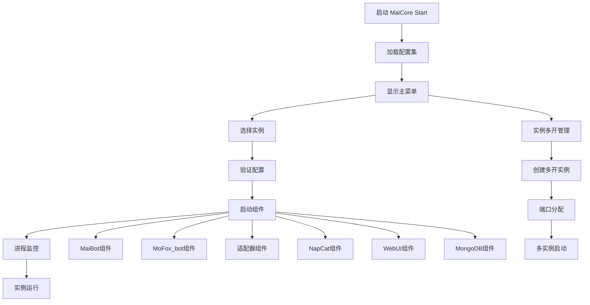

# MaiCore Start 启动指南

> **欢迎使用 MaiCore Start 启动系统！** 这是一个全面的启动指南，将详细介绍启动流程和程序独特的三大核心机制。

::: tip 温馨提示
本指南将深入阐释配置集机制、进程监控机制和实例多开机制，帮助您理解程序的强大功能。
:::

## 📋 目录

- [启动流程概述](#启动流程概述)
- [配置集机制详解](#配置集机制详解)
- [进程监控机制详解](#进程监控机制详解)
- [实例多开机制详解](#实例多开机制详解)
- [启动操作指南](#启动操作指南)
- [高级功能使用](#高级功能使用)
- [故障排除](#故障排除)


## 🚀 启动流程概述

### 启动架构图



### 启动流程详解

#### 1. 程序初始化 🔧

当您启动 MaiCore Start 时，系统会按以下顺序初始化：

1. **配置系统初始化**
   - 加载 `config/config.toml` 配置文件
   - 验证配置结构完整性
   - 修复损坏的配置数据

2. **端口管理器初始化**
   - 扫描系统已使用端口
   - 加载端口使用历史
   - 准备端口分配策略

3. **UI界面初始化**
   - 加载主题配置
   - 初始化控制台界面
   - 设置颜色方案

#### 2. 主菜单显示 📱

程序显示功能丰富的主菜单：

```
🚀 MaiCore Start 主菜单
==================================================
[1] 部署新实例
[2] 启动现有实例  
[3] 实例多开管理
[4] 配置管理
[5] 组件下载
[6] 知识库
[7] 实例统计
[8] 系统设置
[Q] 退出程序
```

## ⚙️ 配置集机制详解

### 什么是配置集？

配置集是 MaiCore Start 的<mark>核心创新机制</mark>，它将每个 Bot 实例的所有配置信息封装为一个独立的配置单元。

::: info 配置集特点
- **独立性**: 每个配置集包含完整的实例信息
- **可切换**: 支持在多个配置集间快速切换
- **可管理**: 支持创建、编辑、删除、验证配置集
- **可恢复**: 清晰的引导您重新配置
:::

### 配置集结构

```toml
# config/config.toml
[configurations.default]
serial_number = "1"          #序列号
absolute_serial_number = 1   #绝对序列号
version_path = "0.0.0"       #版本号
nickname_path = "默认配置"    #实例昵称
bot_type = "MaiBot"          #实例类型
mai_path = ""                #MaiBot的主程序地址
mofox_path = ""              #MoFox_bot的主程序地址
adapter_path = ""            #适配器地址
napcat_path = ""             #NapCat地址
napcat_version = ""          #NapCat版本
qq_account = ""              #当前实例的QQ号
```

### 配置集管理功能

#### 1. 自动配置检测 🔍

程序具备强大的<mark>自动检测能力</mark>：

- **Bot路径检测**: 自动扫描指定目录下的 Bot 实例
- **配置文件解析**: 读取 `bot_config.toml` 预填充信息
- **组件路径检测**: 自动发现适配器、NapCat、WebUI 等组件
- **版本识别**: 自动识别 Bot 版本并推荐相应配置

#### 2. 配置验证与修复 🛠️

```python
def _validate_and_repair_serials(self) -> bool:
    """验证并修复绝对序列号，确保其唯一且升序"""
    repaired = False
    configurations = self.get_all_configurations()
    
    # 检查是否存在问题（重复或不连续）
    serials = [int(cfg.get("absolute_serial_number")) for _, cfg in config_items]
    is_problematic = len(serials) != len(set(serials)) or sorted(serials) != list(range(1, len(serials) + 1))
    
    if is_problematic:
        # 按原始顺序重新分配序列号
        for i, (name, config) in enumerate(config_items):
            self.config["configurations"][name]["absolute_serial_number"] = i + 1
```

#### 3. 配置集操作 🎯

**创建配置集**:
- 自动创建: 扫描现有 Bot 实例并创建配置
- 手动创建: 逐步输入配置信息
- 模板创建: 基于现有配置创建副本

**编辑配置集**:
- 路径更新: 修改 Bot、适配器等组件路径
- 选项调整: 更改安装的组件选项
- 参数修改: 更新版本、昵称、QQ号等

## 📊 进程监控机制详解

### 进程管理架构

MaiCore Start 实现了<mark>极其强大的进程监控机制</mark>，确保每个组件都能被妥善管理。

::: warning 进程监控特点
- **隔离性**: 每个组件在独立进程中运行
- **可控性**: 支持启动、停止、重启单个进程
- **监控性**: 实时监控进程状态和资源使用
- **安全性**: 强制终止进程树，避免僵尸进程
:::

### 进程管理器核心组件

#### 1. _ProcessManager 类 🎛️

```python
class _ProcessManager:
    """内部进程管理器。
    负责在新CMD窗口中启动、跟踪和停止进程。
    """
    def __init__(self):
        self.running_processes: List[Dict[str, Any]] = []
```

**核心功能**:
- **进程启动**: 在新控制台窗口中启动组件
- **进程跟踪**: 维护运行进程的信息列表
- **进程停止**: 安全终止进程及其子进程
- **资源监控**: 监控 CPU、内存使用情况

#### 2. 组件启动机制 🔧

每个组件都继承自 `_LaunchComponent` 基类：

```python
class _LaunchComponent:
    """可启动组件的基类。"""
    def __init__(self, name: str, config: Dict[str, Any]):
        self.name = name
        self.config = config
        self.is_enabled = False

    def check_enabled(self):
        """检查该组件是否根据配置启用。"""
        raise NotImplementedError

    def get_launch_details(self) -> Optional[Tuple[str, str, str]]:
        """获取启动所需的命令、工作目录和窗口标题。"""
        raise NotImplementedError
```

**支持的组件类型**:
- **MongoDB组件**: 管理数据库服务
- **NapCat组件**: 管理 QQ 协议端
- **适配器组件**: 管理 Bot 适配器
- **WebUI组件**: 管理网页控制面板
- **Mai组件**: 管理 Bot 主程序

#### 3. 智能启动策略 🧠

程序采用<mark>智能启动策略</mark>，确保组件按正确顺序启动：

```python
def launch(self, components_to_start: List[str]) -> bool:
    """根据给定的组件列表启动。"""
    # 确保MongoDB总是最先启动，虽然它总是用不上
    if self._components['mongodb'].is_enabled:
        if not self._components['mongodb'].start(self._process_manager):
            ui.print_warning("MongoDB启动失败，但将继续尝试启动其他组件。")
    
    # 按顺序启动组件
    launch_order = ["napcat", "webui", "adapter", "mai"]
    final_success = True
    
    for comp_name in launch_order:
        if comp_name in components_to_start:
            if not self._components[comp_name].start(self._process_manager):
                # 麦麦本体是核心，如果它失败了，整个启动就算失败
                if comp_name == "mai":
                    final_success = False
                    break
```

#### 4. 进程监控界面 📈

程序提供直观的进程监控界面：

```
📊 进程状态管理
┌──────┬────────────────────┬────────┬──────────────┬──────────────┐
│ PID  │ 进程名称            │ CPU %  │ 内存 (MB)    │ 运行时间 (s) │
├──────┼────────────────────┼────────┼──────────────┼──────────────┤
│ 1234 │ 麦麦启动器          │ 2.15   │ 45.32        │ 3600         │
│ 5678 │ MaiBot主程序        │ 15.67  │ 128.45       │ 3595         │
│ 9012 │ NapCatQQ            │ 8.23   │ 89.12        │ 3590         │
│ 3456 │ 适配器              │ 3.45   │ 56.78        │ 3585         │
└──────┴────────────────────┴────────┴──────────────┴──────────────┘
```

### 进程安全机制

#### 1. 强制进程终止 ⚡

```python
def stop_process(self, pid: int) -> bool:
    """通过PID停止单个进程及其子进程。"""
    # 优先使用 taskkill (仅限Windows) 来确保终止整个进程树
    if os.name == 'nt':
        kill_command = ["taskkill", "/F", "/T", "/PID", str(pid)]
        result = subprocess.run(
            kill_command,
            capture_output=True,
            text=True,
            check=False,
            creationflags=subprocess.CREATE_NO_WINDOW
        )
```

#### 2. 进程状态缓存 🔄

```python
def show_running_processes(self):
    """以表格形式显示当前正在运行的进程状态，并使用缓存计算CPU。"""
    # 清理已结束进程的缓存
    for pid in list(self._process_cache.keys()):
        if pid not in current_pids:
            del self._process_cache[pid]
    
    # 使用缓存避免重复创建 Process 对象
    for meta in all_process_meta:
        p = self._process_cache.get(pid)
        if p is None:
            p = psutil.Process(pid)
            p.cpu_percent()  # 第一次调用返回0，但会初始化计时器
            self._process_cache[pid] = p
```

---

## 🔀 实例多开机制详解

### 多开机制概述

实例多开是 MaiCore Start 的<mark>革命性功能</mark>，允许用户同时运行多个 Bot 实例，每个实例都有独立的配置和端口。

::: tip 多开优势
- **资源隔离**: 每个实例独立运行，互不干扰
- **端口自动分配**: 智能避免端口冲突
- **统一管理**: 通过统一界面管理所有实例
- **灵活配置**: 每个实例可使用不同配置
:::

### 多开架构设计

#### 1. 实例标识系统 🏷️

```python
def create_multi_instance(self, base_config: Dict[str, Any], instance_name: Optional[str] = None) -> str:
    """创建多开实例"""
    # 生成实例ID
    instance_id = str(uuid.uuid4())[:8]
    if not instance_name:
        instance_name = f"多开实例_{instance_id}"
    
    # 创建多开实例配置
    multi_instance = {
        "id": instance_id,
        "name": instance_name,
        "bot_type": bot_type,
        "base_config_name": self._get_config_name_from_config(base_config),
        "created_time": str(Path().cwd()),
        "status": "created",  # created, running, stopped
        "ports": {
            "main_port": main_port,
            "secondary_port": secondary_port
        }
    }
```

**实例属性**:
- **ID**: 8位唯一标识符
- **名称**: 用户友好的实例名称
- **类型**: MaiBot 或 MoFox_bot
- **状态**: created/running/stopped
- **端口**: 主程序端口和辅助端口

#### 2. 端口智能分配 🎯

端口管理器采用<mark>智能分配算法</mark>：

```python
def get_next_instance_port(self, instance_type: str, base_config: Dict) -> Tuple[int, int]:
    """为新实例获取下一个可用端口组合，支持多实例混用"""
    if instance_type == "MaiBot":
        # MaiBot需要主程序端口和WebUI端口
        try:
            main_port = self.find_available_port("mai_main")
        except:
            main_port = self.find_available_port("mofox_main")  # 扩展搜索
        
        try:
            webui_port = self.find_available_port("mai_webui", main_port + 1)
        except:
            webui_port = self.find_available_port("webui", main_port + 1)
            
        return main_port, webui_port
```

**端口分配策略**:
- **MaiBot**: 主程序(8000-8100) + WebUI(8001-8101)
- **MoFox_bot**: 主程序(8000-8100) + NapCat(8090-8190)
- **冲突检测**: 自动检测并避免端口冲突
- **范围扩展**: 主范围冲突时自动扩展到备用范围

#### 3. 配置继承机制 🔗

多开实例基于基础配置创建，但会进行个性化调整：

```python
def _get_base_config_for_instance(self, instance: Dict[str, Any]) -> Dict[str, Any]:
    """为多开实例获取基础配置"""
    # 获取基础配置
    config_name = instance.get("base_config_name", "")
    base_config = all_configs.get(config_name, {})
    
    # 更新端口信息
    ports = instance.get("ports", {})
    main_port = ports.get("main_port")
    secondary_port = ports.get("secondary_port")
    
    if main_port:
        # 更新.env文件
        env_path = os.path.join(instance_path, ".env")
        if instance["bot_type"] == "MaiBot":
            port_manager.update_env_file(env_path, main_port, secondary_port)
        else:
            port_manager.update_env_file(env_path, main_port)
        
        # 更新适配器配置
        adapter_path = base_config.get("adapter_path", "")
        if adapter_path and os.path.exists(adapter_path):
            if instance["bot_type"] == "MaiBot":
                adapter_config_path = os.path.join(adapter_path, "config.toml")
                port_manager.update_maibot_adapter_config(adapter_config_path, main_port, secondary_port)
```

### 多开管理界面

#### 1. 实例列表显示 📋

```
🚀 实例多开管理
==================================================
[端口使用状态]
  MaiBot实例:
    - 我的麦麦1: 主程序(8000) + WebUI(8001)
    - 我的麦麦2: 主程序(8002) + WebUI(8003)
  MoFox_bot实例:
    - 墨狐测试: 主程序(8004) + NapCat(8090)

┌────────┬──────────────┬──────────┬──────────┬──────────┐
│ ID     │ 名称         │ 类型     │ 状态     │ 端口     │
├────────┼──────────────┼──────────┼──────────┼──────────┤
│ a1b2c3d4│ 我的麦麦1    │ MaiBot   │ running  │ 8000/8001│
│ e5f6g7h8│ 我的麦麦2    │ MaiBot   │ stopped  │ 8002/8003│
│ i9j0k1l2│ 墨狐测试     │ MoFox_bot│ running  │ 8004/8090│
└────────┴──────────────┴──────────┴──────────┴──────────┘

[操作选项]
 [A] 创建新的多开实例
 [B] 启动多开实例
 [C] 停止多开实例
 [D] 删除多开实例
 [E] 查看实例详情
 [Q] 返回上级菜单
```

#### 2. 实例操作功能 ⚡

**创建实例**:
1. 选择基础配置
2. 输入实例名称
3. 自动分配端口
4. 创建实例配置

**启动实例**:
1. 验证实例配置
2. 分配可用端口
3. 更新配置文件
4. 启动组件服务

**停止实例**:
1. 停止所有相关进程
2. 释放端口占用
3. 更新实例状态

**删除实例**:
1. 确认实例状态
2. 停止运行中的实例
3. 删除实例配置
4. 清理端口信息

---

## 🎮 启动操作指南

### 快速启动流程

#### 1. 选择启动方式 🚀

```
🚀 启动选择菜单
==================================================
实例版本: 0.10.5
实例昵称: 我的麦麦
Bot 类型: MaiBot

[可用组件]
  • 适配器: ✅ 可用
  • NapCatQQ: ✅ 可用
  • 检查MongoDB: ❌ 未配置
  • 控制面板: ✅ 可用
  • 麦麦本体: ✅ 可用

[预设启动项]
 [1] 主程序+适配器
 [2] 主程序+适配器+NapCatQQ
 [3] 主程序+适配器+检查MongoDB
 [4] 主程序+适配器+NapCatQQ+检查MongoDB
 [5] 主程序+适配器+控制面板
 [6] 主程序+适配器+NapCat+控制面板

 [H] 高级启动项
 [Q] 返回
```

#### 2. 高级启动选项 🛠️

高级启动支持<mark>多选组件</mark>：

```
🛠️ 高级启动项
==================================================
可多选，请使用英文逗号','分隔选项（例如: 1,3）

 [1] 主程序 - ✅ 可用
 [2] 适配器 - ✅ 可用
 [3] NapCatQQ - ✅ 可用
 [4] 检查MongoDB - ❌ 未配置
 [5] 控制面板 - ✅ 可用

 [Q] 返回

请选择要启动的组件: 1,2,5
```

### 启动流程详解

#### 1. 配置验证 ✅

```python
def validate_configuration(self, config: Dict[str, Any]) -> list:
    """验证配置的有效性。"""
    errors = []
    
    # 验证Bot路径
    bot_type = config.get("bot_type", "MaiBot")
    if bot_type == "MoFox_bot":
        mai_path = config.get("mofox_path", "")
    else:
        mai_path = config.get("mai_path", "")
    
    valid, msg = validate_path(mai_path, check_file="bot.py")
    if not valid:
        errors.append(f"麦麦本体路径: {msg}")

    # 验证适配器路径
    if self._components['adapter'].is_enabled:
        adapter_path = config.get("adapter_path", "")
        valid, msg = validate_path(adapter_path, check_file="main.py")
        if not valid:
            errors.append(f"适配器路径: {msg}")

    # 验证NapCat路径
    if self._components['napcat'].is_enabled:
        napcat_path = config.get("napcat_path", "")
        if not (napcat_path and os.path.exists(napcat_path) and napcat_path.lower().endswith('.exe')):
            errors.append("NapCat路径: 无效或文件不存在。")
    
    return errors
```

#### 2. 组件启动顺序 📋

**标准启动顺序**:
1. **MongoDB** (如果启用) - 数据库服务
2. **NapCat** - QQ 协议端
3. **WebUI** - 网页控制面板
4. **适配器** - Bot 适配器
5. **MaiBot/MoFox_bot** - Bot 主程序

**启动逻辑**:
- MongoDB 优先启动，确保数据库可用
- NapCat 在适配器前启动，确保 QQ 连接就绪
- WebUI 独立启动，不依赖其他组件
- 适配器连接 Bot 和 NapCat
- Bot 主程序最后启动，协调所有组件

#### 3. 启动成功确认 ✅

```
🎉 启动流程完成！
==================================================
✅ MongoDB服务已启动
✅ NapCatQQ已启动 (PID: 1234)
✅ 控制面板已启动 (http://localhost:7999)
✅ 适配器已启动 (PID: 5678)
✅ 麦麦本体已启动 (PID: 9012)

🌐 访问地址:
   • Bot主程序: http://localhost:8000
   • 控制面板: http://localhost:7999

📱 进程监控:
   使用 [进程管理] 功能查看实时状态
```


## 🔧 高级功能使用

### 进程管理功能

#### 1. 进程状态监控 📊

程序提供<mark>实时进程监控</mark>：

```
╭────────────────────────────────────────────────────── 可用命令 ──────────────────────────────────────────────────────╮
│ stop <PID>       终止指定PID的进程                                                                                   │
│ restart <PID>    重启指定PID的进程                                                                                   │
│ details <PID>    查看指定PID的进程详情                                                                               │
│ stopall          终止所有受管进程                                                                                    │
│ q / quit         退出状态监控                                                                                        │
│ Tab键            补全指令或PID                                                                                       │
│                                                                                                                      │
│                                                                                                                      │
│                                                                                                                      │
╰──────────────────────────────────────────────────────────────────────────────────────────────────────────────────────╯
                            [📊 进程状态管理]
┏━━━━━━━━━━┳━━━━━━━━━━━━━━━━━━━━━━━━━┳━━━━━━━┳━━━━━━━━━━━┳━━━━━━━━━━━━━━┓
┃ PID      ┃ 进程名称                ┃ CPU % ┃ 内存 (MB) ┃ 运行时间 (s) ┃
┡━━━━━━━━━━╇━━━━━━━━━━━━━━━━━━━━━━━━━╇━━━━━━━╇━━━━━━━━━━━╇━━━━━━━━━━━━━━┩
│ 23936    │ 麦麦启动器 (主程序)     │  7.70 │     60.71 │          218 │
│ 22420    │ MaiBot 控制面板 - main  │  0.00 │      7.45 │           60 │
│ 25872    │ maimai - 适配器 vmain   │  0.00 │      5.58 │           60 │
│ 12332    │ maimai - 麦麦本体 vmain │  0.00 │      5.59 │           58 │
└──────────┴─────────────────────────┴───────┴───────────┴──────────────┘


╭────────────────────────────────────────────────────── 输入命令 ──────────────────────────────────────────────────────╮
│ > _                                                                                                                  │
╰──────────────────────────────────────────────────────────────────────────────────────────────────────────────────────╯


```

#### 2. 进程操作 ⚡

**重启进程`restart <PID>`**:
- 停止现有进程
- 等待端口释放
- 重新启动进程
- 确认启动状态

**停止进程`stop <PID>` or `stopall`**:
- 发送终止信号
- 强制结束进程树
- 清理进程缓存
- 更新状态显示

**查看详情`details <PID>`**:
- 进程基本信息
- 内存使用情况
- 启动时间
- 命令行参数
- 工作目录

### 配置管理功能

#### 1. 配置集操作 🎯

**创建配置集**:
- 自动检测现有 Bot
- 手动输入配置信息
- 验证配置有效性
- 保存配置集

**编辑配置集**:
- 修改路径信息
- 调整组件选项
- 更新基本参数
- 重新验证配置

**配置集切换**:
- 序列号选择
- 列表选择
- 默认设置

#### 2. 配置验证与修复 🔧

程序会自动检测和修复配置问题：

- **路径验证**: 检查所有路径是否有效
- **文件检查**: 确认必需文件存在
- **版本兼容**: 验证版本与组件兼容性
- **序列号修复**: 自动修复重复或错误的序列号

### 多开实例高级功能

#### 1. 批量操作 📦

**批量启动**:
- 选择多个实例
- 依次启动每个实例
- 显示启动结果
- 监控运行状态

**批量停止**:
- 停止所有运行实例
- 释放所有占用端口
- 更新实例状态

**批量删除**:
- 确认删除操作
- 停止运行中的实例
- 删除实例配置
- 清理相关文件

#### 2. 实例模板 📋

创建实例模板以快速部署：

```python
# 基于现有实例创建模板
def create_instance_template(self, instance_id: str, template_name: str) -> bool:
    """创建实例模板"""
    instance = self.get_multi_instance(instance_id)
    if not instance:
        return False
    
    template = {
        "name": template_name,
        "bot_type": instance["bot_type"],
        "base_config_name": instance["base_config_name"],
        "install_options": instance.get("install_options", {}),
        "is_template": True
    }
    
    # 保存模板
    templates = self.config.get("instance_templates", {})
    templates[template_name] = template
    self.config.set("instance_templates", templates)
    self.config.save()
    
    return True
```


## ❓ 故障排除

### 常见启动问题

#### 1. 配置验证失败 ❌

**问题**: 配置验证显示错误

```
❌ 配置验证失败：
  • 麦麦本体路径: 路径不存在或缺少bot.py文件
  • 适配器路径: 路径不存在或缺少main.py文件
  • NapCat路径: 无效或文件不存在
```

**解决方案**:
1. **检查路径**: 确认所有路径正确且文件存在
2. **重新配置**: 使用配置管理功能更新路径
3. **重新部署**: 如果路径确实改变，重新部署实例

#### 2. 端口冲突 🚫

**问题**: 端口被占用

```
❌ 端口 8000 已被占用
```

**解决方案**:
1. **检查占用进程**: 使用 `netstat -ano | findstr :8000`
2. **停止冲突进程**: 结束占用端口的进程
3. **使用多开功能**: 创建新实例自动分配其他端口

#### 3. 组件启动失败 ⚠️

**问题**: 某个组件启动失败

```
⚠️ 适配器启动失败
```

**解决方案**:
1. **检查依赖**: 确认 Python 环境和依赖包
2. **检查配置**: 验证配置文件正确性
3. **查看日志**: 检查组件日志文件
4. **重新安装**: 必要时重新安装组件

#### 4. 进程管理问题 🔄

**问题**: 进程无法停止

```
❌ 停止进程失败
```

**解决方案**:
1. **使用任务管理器**: 手动结束进程
2. **重启程序**: 重启 MaiCore Start
3. **强制终止**: 使用任务管理器强制结束

### 高级故障排除

#### 1. 配置文件损坏 🗂️

**检测**: 程序启动时提示配置损坏

**修复**: 
```python
# 程序会自动修复损坏的配置
def _validate_and_repair_serials(self) -> bool:
    """验证并修复绝对序列号"""
    repaired = False
    # 重新分配序列号
    for i, (name, config) in enumerate(config_items):
        self.config["configurations"][name]["absolute_serial_number"] = i + 1
    return repaired
```

#### 2. 端口管理器异常 🔌

**检测**: 端口分配失败

**解决方案**:
1. **重启端口管理器**: 重启程序重置端口状态
2. **手动释放端口**: 结束占用端口的进程
3. **扩展端口范围**: 修改端口范围配置

#### 3. 多开实例冲突 🔀

**检测**: 多开实例无法启动

**解决方案**:
1. **检查端口分配**: 确认端口分配正确
2. **验证配置继承**: 检查基础配置是否有效
3. **清理实例状态**: 删除并重新创建实例


## 📞 获取帮助

### 官方资源

<NCard title="MaiBot Docs" link="https://docs.mai-mai.org">
MaiBot 官方文档中心
</NCard>

<NCard title="MoFox_bot Docs" link="https://docs.mofox-sama.com/">
MoFox_bot 官方文档中心
</NCard>

### 社区支持

- **QQ技术群**: 搜索相关技术交流群
- **论坛讨论**: 参与技术讨论和经验分享
- **在线文档**: 查看详细的在线文档

### 问题反馈

如果您遇到启动问题，请提供以下信息：

- **错误信息**: 完整的错误提示
- **系统环境**: Windows版本、Python版本等
- **操作步骤**: 详细的操作过程
- **日志文件**: 相关的日志内容


## 📄 更新日志

### v4.1.2-beta
- ✨ 全新启动系统
- 🔧 优化配置集机制
- 📊 增强进程监控
- 🔀 完善多开功能
- 🐛 修复已知问题

### v4.1.1
- 🚀 提升启动速度
- 💾 改进配置管理
- 🔒 增强稳定性

---


**感谢使用 MaiCore Start 启动系统！** 

通过配置集机制、进程监控机制和实例多开机制，程序为用户提供了强大而灵活的 Bot 管理体验。如果您觉得这个启动系统有帮助，请给项目点个星⭐！

## [TOP](#📋-目录)

<!-- 启动指南结束 -->